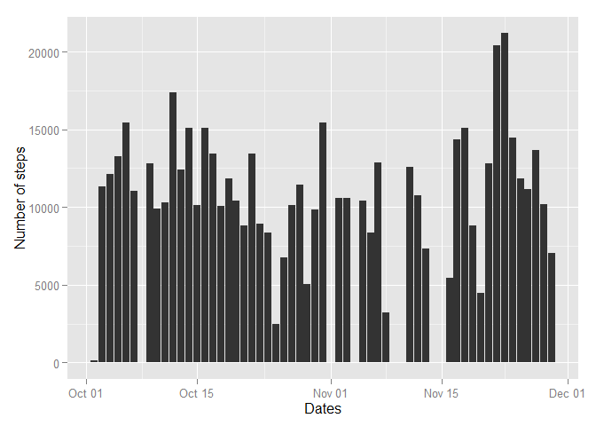
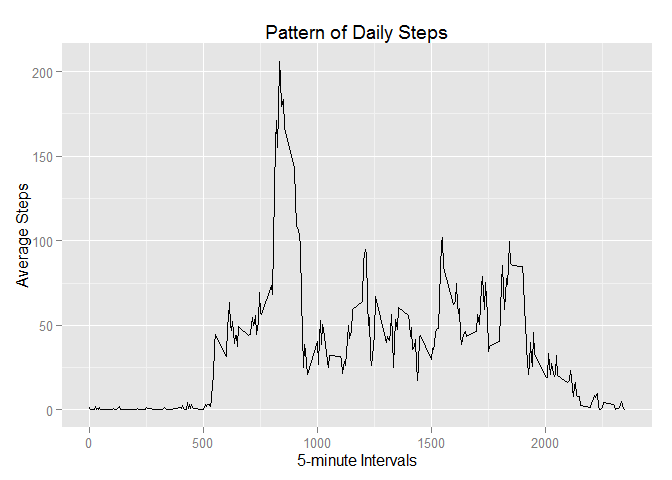
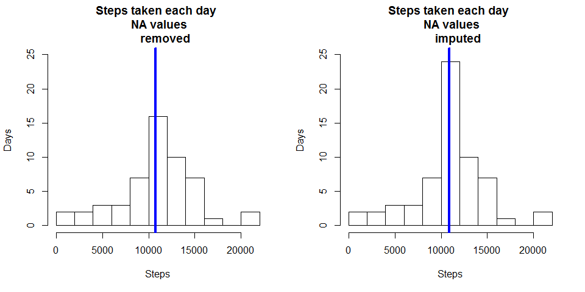
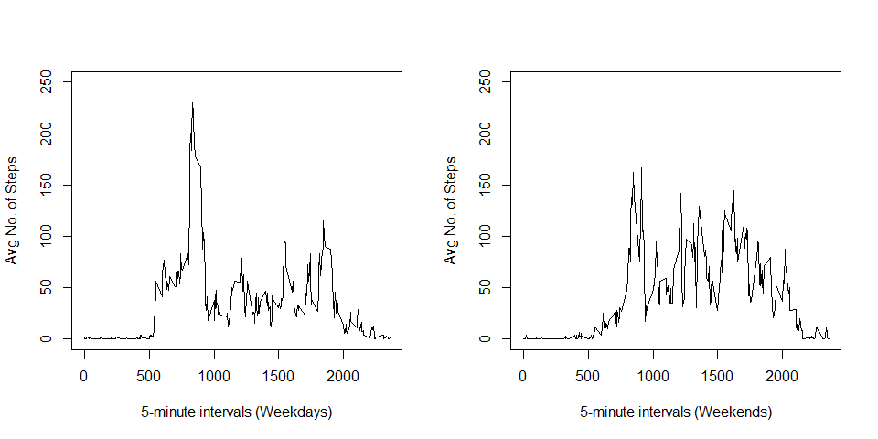

# Reproducible Research Project 1
sequeiraneil  

This assignment makes use of data from a personal activity monitoring
device. This device collects data at 5 minute intervals through out the
day. The data consists of two months of data from an anonymous
individual collected during the months of October and November, 2012
and include the number of steps taken in 5 minute intervals each day.

For this assignment, we will be using the *dplyr* package to transform data, & 
both the *base* plotting & *gglot2* package to create the plots.


```r
library(dplyr)
library(ggplot2)
```


### The project follows this outline:

1. Load & process the data
2. What is the mean total number of steps taken per day?
3. What is the average daily activity pattern?
4. Imputing missing values
5. Are there differences in activity patterns between weekdays and weekends?


## Loading & processing the data

Unzip the file, read the contents of the file, & run a str method on the data


```r
a <- unzip("activity.zip")
activity <- read.csv(a, stringsAsFactors = FALSE)
activity <- tbl_df(activity)
str(activity)
```

```
## Classes 'tbl_df', 'tbl' and 'data.frame':	17568 obs. of  3 variables:
##  $ steps   : int  NA NA NA NA NA NA NA NA NA NA ...
##  $ date    : chr  "2012-10-01" "2012-10-01" "2012-10-01" "2012-10-01" ...
##  $ interval: int  0 5 10 15 20 25 30 35 40 45 ...
```


The date field doesn't look like it is formatted as date, so transform it here.


```r
activity$date <- as.Date(activity$date)
str(activity)
```

```
## Classes 'tbl_df', 'tbl' and 'data.frame':	17568 obs. of  3 variables:
##  $ steps   : int  NA NA NA NA NA NA NA NA NA NA ...
##  $ date    : Date, format: "2012-10-01" "2012-10-01" ...
##  $ interval: int  0 5 10 15 20 25 30 35 40 45 ...
```


### What is the mean total number of steps taken per day?

We first calculate the total number of steps taken per day, ignoring 
the missing values for this calculation


```r
total_daily_steps <- activity %>% 
                        group_by(date) %>%
                        filter(!is.na(steps)) %>%       # ignores missing values
                        summarise(tot = sum(steps))

head(total_daily_steps)
```

```
## Source: local data frame [6 x 2]
## 
##         date   tot
## 1 2012-10-02   126
## 2 2012-10-03 11352
## 3 2012-10-04 12116
## 4 2012-10-05 13294
## 5 2012-10-06 15420
## 6 2012-10-07 11015
```


### Create a histogram of the total number of steps:


```r
ggplot(total_daily_steps, aes(x = date, y = tot)) +
        geom_bar(stat = "identity") +
        xlab("Dates") +
        ylab("Number of steps")
```

 


The **mean** number of steps, ignoring the NA values:


```r
mean(total_daily_steps$tot, na.rm = TRUE)
```

```
## [1] 10766.19
```

The **median** number of steps, ignoring the NA values


```r
median(total_daily_steps$tot, na.rm = TRUE)
```

```
## [1] 10765
```


### What is the average daily pattern?

Make a time series plot (i.e. type = "l") of the 5-minute interval (x-axis) 
and the average number of steps taken, averaged across all days (y-axis)

A: This requires the data to be aggregated at each interval. Note that the 
xlabels refer to 5 minute interval time slots, ranging from 00:00 hours to 
24:00 hours.


```r
steps_per_interval <- activity %>%
                        group_by(interval) %>%
                        filter(!is.na(steps)) %>%       
                        summarise(steps_pi = mean(steps))

ggplot(steps_per_interval,
       aes(x = steps_per_interval$interval, y = steps_per_interval$steps_pi)) +
        geom_line() +
        labs(x= "5-minute Intervals", y = "Average Steps", 
             title = "Pattern of Daily Steps")
```

 


### Which 5-minute interval, on average across all the days in the dataset, contains the maximum number of steps?

A: It appears that the most number of steps, on average, are taken at 835am (206 steps)


```r
filter(steps_per_interval, steps_pi == max(steps_pi))
```

```
## Source: local data frame [1 x 2]
## 
##   interval steps_pi
## 1      835 206.1698
```


### Imputing missing values

To calculate and report the total number of missing values in the dataset (i.e. the total number of rows with NAs)

A: There are 2304 missing values in the dataset


```r
sum(is.na(activity$steps))
```

```
## [1] 2304
```


### Devise a strategy for filling in all of the missing values in the dataset. 

A: The assumption is that since people are creatures of habit, hence activities 
will follow a daily pattern.  This is the logic used to impute values where 
there are missing values, & hence the 5 minute interval mean is used. 


### Create a new dataset that is equal to the original dataset but with the missing data filled in.


```r
steps <- data.frame(activity$steps)
steps[is.na(steps),] <- ceiling(tapply(X=activity$steps,INDEX=activity$interval,
                                       FUN=mean,na.rm=TRUE))
new <- cbind(steps, activity[,2:3])
colnames(new) <- c("Steps", "Date", "Interval")
new <- tbl_df(new)

new <- mutate(new, Date = as.Date(Date))

new_total_daily_steps <- new %>%
                        group_by(Date) %>%
                        summarise(t = sum(Steps))
```


### Make a histogram of the total number of steps taken each day and Calculate and report the mean and median total number of steps taken per day.  


```r
par(mfrow = c(1, 2))

# with na values eliminated
hist(total_daily_steps$tot, 10, main = "Steps taken each day \n NA values
     removed", xlab = "Steps", ylab = "Days", ylim = c(0, 25))
abline(v = median(total_daily_steps$tot), col = 4, lwd  = 4)

# with NA values imputed
hist(new_total_daily_steps$t, 10, main = "Steps taken each day \n NA values
     imputed", xlab = "Steps", ylab = "Days", ylim = c(0, 25))
abline(v = median(new_total_daily_steps$t), col = 4, lwd  = 4)
```

 

### What is the impact of imputing missing data on the estimates of the total daily number of steps?

Mean number of steps:


```r
mean(new_total_daily_steps$t, na.rm = TRUE)
```

```
## [1] 10784.92
```


Median number of steps


```r
median(new_total_daily_steps$t, na.rm = TRUE)
```

```
## [1] 10909
```

### Do these values differ from the estimates from the first part of the assignment?

It appears that introducing missing data as an imputed value has caused both the mean & median values to increase:


```r
mean(new_total_daily_steps$t) - mean(total_daily_steps$tot) 
```

```
## [1] 18.72935
```

```r
median(new_total_daily_steps$t) - median(total_daily_steps$tot)
```

```
## [1] 144
```


### Are there differences in activity patterns between weekdays and weekends?
The dataset with the missing values filled in is used for this exercise. 


### Create a new factor variable in the dataset with two levels - "weekday" and "weekend" indicating whether a given date is a weekday or weekend day.


```r
new <- mutate(new, wd = weekdays(Date))
new$fw[new$wd == "Sunday" | new$wd == "Saturday"] <- "Weekend"
new[is.na(new$fw),5] <- "Weekday"

wday <- new %>%
                group_by(Interval) %>%
                filter(fw == 'Weekday') %>%
                filter(!is.na(Steps)) %>%
                summarise(steps_wday = mean(Steps))

wend <- new %>%
                group_by(Interval) %>%
                filter(fw == 'Weekend') %>%       
                summarise(steps_wend = mean(Steps))
```


### Make a panel plot containing a time series plot (i.e. type = "l") of the 5-minute interval (x-axis) and the average number of steps taken, averaged across all weekday days or weekend days (y-axis). 


```r
par(mfrow = c(1,2))

plot (y = wday$steps_wday, x = wday$Interval, type = "l", ylim = c(0, 250), 
      xlab = "5-minute intervals (Weekdays)", ylab = "Avg No. of Steps")
plot (y = wend$steps_wend, x = wend$Interval, type = "l", ylim = c(0, 250),
      xlab = "5-minute intervals (Weekends)", ylab = "Avg No. of Steps")
```

 

There's a distinct difference in activity levels between weekdays & weekends.
This random person may have had the opportunity to sleep in on the weekend (note
the later activity start in the second plot). I speculate that this person has 
a desk job (not much steps during the day), while over the weekend, they are 
more active throughout the day.
